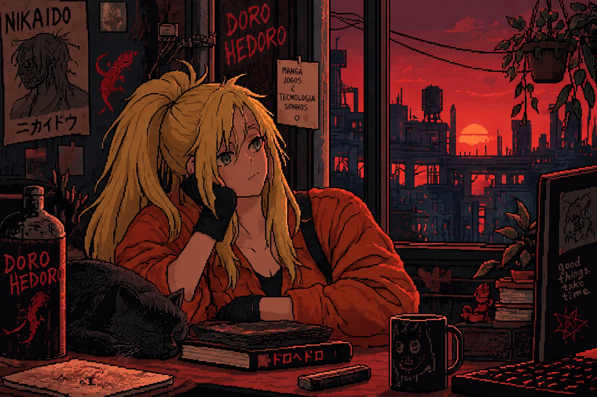

<div align="center">



<br/>


**Análise e Desenvolvimento de Sistemas · Arte · Tecnologia**

[](https://github.com/ellenle31)
[](https://github.com/ellenle31)
[](https://github.com/ellenle31)

</div>

---


## `01. / ABOUT ME`

Oi! Sou a Ellen, estudante de **Análise e Desenvolvimento de Sistemas** pelo Senac, através do Embarque Digital.

Estou no início da minha jornada na programação e explorando as possibilidades da tecnologia, especialmente onde ela encontra a criatividade.

- 💻 Estudando lógica de programação e linguagem C.
- 🎨 Explorando design de interfaces e Figma.
- 🗄️ Desenvolvendo meus conhecimentos em banco de dados.
- 🎮 Gamer, artista e curiosa por novas tecnologias.

<br clear="right"/>

---

## `02. / TECH & TOOLS`

<div align="center">


</div>

> Algumas dessas ferramentas ainda fazem parte do meu aprendizado. Estou construindo minhas habilidades projeto por projeto.

---


<h2 align="left">03. / PROJECTS & EXPERIMENTS</h2>

<p>
  
  
</p>

<table>
<tr>
<td width="50%" valign="top">

### 💻 `01 — PROGRAMMING`

**Primeiros passos no código**

Exercícios e projetos desenvolvidos durante meus estudos de lógica de programação e linguagem C.


<!-- Troque # pelo link do repositório quando criar o projeto -->
<a href="https://github.com/ellenle31?tab=repositories">
  
</a>

</td>
<td width="50%" valign="top">

### 🗄️ `02 — DATABASE`

**Organizando informações**

Estudos de modelagem de dados e banco de dados realizados durante a faculdade de ADS.


<a href="https://github.com/ellenle31?tab=repositories">
  
</a>

</td>
</tr>
<tr>
<td width="50%" valign="top">


<h2 align="left">03. / PROJECTS & EXPERIMENTS</h2>

<p>
  
  
</p>

<table>
<tr>
<td width="50%" valign="top">

### 💻 `01 — PROGRAMMING`

**First steps in code**

Exercícios e estudos desenvolvidos durante minha jornada aprendendo lógica de programação e linguagem C.


</td>
<td width="50%" valign="top">

### 🗄️ `02 — DATABASE`

**Organizing information**

Estudos de modelagem de dados e banco de dados durante a faculdade de ADS.


</td>
</tr>
<tr>
<td width="50%" valign="top">

### 🎨 `03 — CREATIVE TECH`

**Design meets technology**

Explorando interfaces, composição visual e a conexão entre design e desenvolvimento.


</td>
<td width="50%" valign="top">

### 🧪 `04 — NEXT EXPERIMENT`

**Work in progress...**

Novas ideias, projetos acadêmicos e experimentos criativos serão adicionados aqui conforme eu desenvolver minhas habilidades.


</td>
</tr>
</table>

<div align="center">


</div>

---


## `04. / CURRENT STATUS`

```text
> Learning: C / Programming Logic
> Exploring: UI Design / Databases
> Interested in: Creative Technology
> Status: Building, testing, learning...
```

<div align="center">


<sub>Always learning. Always creating.</sub>

</div>
